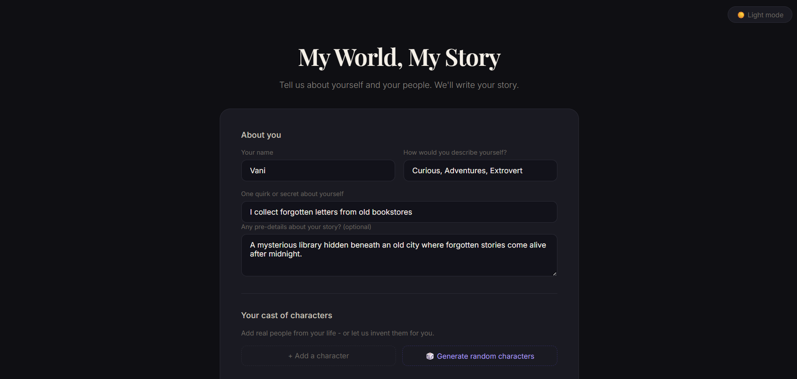
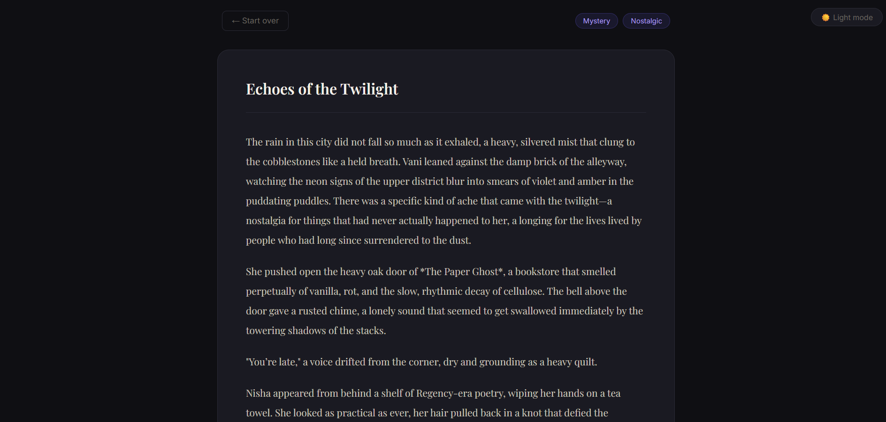
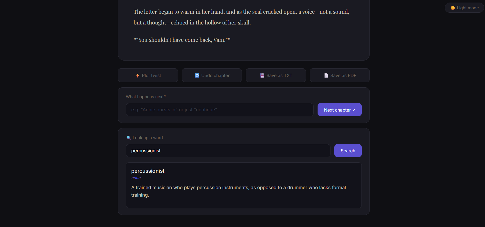

# My World, My Story 📖

> You're not just a reader — you're the main character.

## 🌐 Live Demo
👉 [my-world-my-story.onrender.com](https://my-world-my-story.onrender.com)

## 💡 Why I Built This
Most AI story generators feel disconnected — random characters, generic plots, nothing that actually feels like your life. I wanted something more personal. Something where the people you know become the cast, your quirks become plot devices, and you can actually shape where the story goes.

So I built it.

## ✨ What It Does
Describe yourself, add real people from your life, pick a genre and mood — and the AI writes a personalized story starring you. Don't like where it's going? Throw in a plot twist, add details before the next chapter, or undo it entirely. Every story also gets a unique AI-generated literary title.

## 🚀 Features

**Story Generation**
- Personalized stories based on real people in your life
- AI-generated literary titles for every story
- 6 genres: Romcom, Suspense, Fantasy, Sci-Fi, Horror, Mystery
- Multiple narrator voices and fully custom moods
- Pre-details — tell the AI exactly what you want included
- Random character generator

**Reading Experience**
- Continue your story chapter by chapter
- Plot twist button for unexpected turns
- Undo last chapter if you change your mind
- In-app word lookup — no tab switching needed
- Light and dark theme toggle

**Your Personal Space**
- Login and signup with secure password hashing
- Personal dashboard with your full story library
- Auto-generated story covers per genre and mood
- Download any story as a formatted PDF
- Stories auto-save — always there when you come back

## 🛠 Tech Stack

| Layer | Technology |
|-------|-----------|
| Backend | Python, Flask |
| Database | SQLite |
| Frontend | HTML, CSS, JavaScript |
| AI | OpenRouter API (multi-model fallback) |
| PDF Export | fpdf2 |
| Auth | Werkzeug + Flask sessions |
| Deployment | Render |


## ⚙️ Run Locally

```bash
git clone https://github.com/vanshianeja/my-world-my-story.git
cd my-world-my-story
python -m venv venv
venv\Scripts\activate
pip install -r requirements.txt
```

Create a `.env` file:
OPENROUTER_API_KEY=your_key_here

Then:
```bash
python app.py
```

Open `http://127.0.0.1:5000`

## 📁 Project Structure
my-world-my-story/
├── app.py # Flask server and all routes
├── story_engine.py # AI story generation + multi-model fallback
├── word_lookup.py # Dictionary API integration
├── pdf_generator.py # PDF export
├── cover_generator.py # SVG story cover generator
├── database.py # SQLite database setup
├── templates/
│ ├── index.html # Main story app
│ ├── login.html # Login page
│ ├── signup.html # Signup page
│ └── dashboard.html # Personal dashboard
└── static/
├── style.css
└── script.js

## 📸 Screenshots

**Login**


**Dashboard**


**Story Form**


**Story Screen**



---

*First solo project. Definitely not the last.*