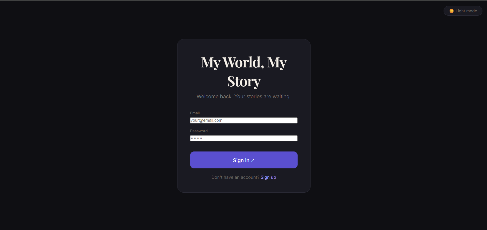
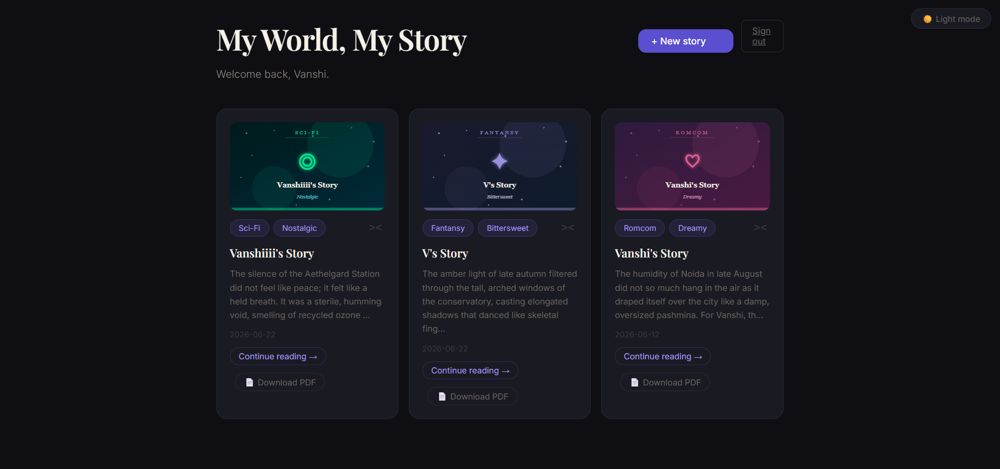
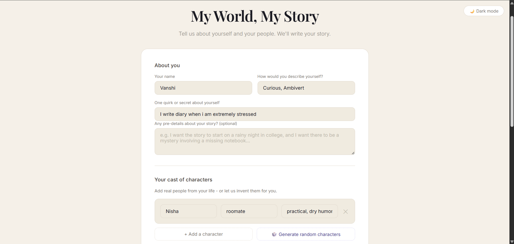
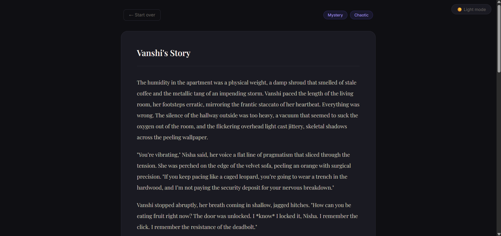

# My World, My Story 📖

An AI-powered personalized story generator. Tell us about yourself and 
the people in your life — we'll write your story.

## Features

**Story Generation**
- Personalized stories based on real people in your life
- Multiple genres: Romcom, Suspense, Fantasy, Sci-Fi, Horror, Mystery
- Multiple narrator voices and custom moods
- Pre-details — tell the AI exactly what you want included
- Random character generator

**Reading Experience**
- Continue your story chapter by chapter
- Plot twist button for unexpected turns
- Undo last chapter
- Word lookup — get definitions without leaving the app
- Light and dark theme toggle

**Your Personal Space**
- Login and signup system with secure password hashing
- Personal dashboard with all your stories
- Auto-generated story covers per genre and mood
- Download any story as a formatted PDF
- Delete stories you no longer want

## Tech Stack

- **Backend:** Python, Flask, SQLite
- **Frontend:** HTML, CSS, JavaScript
- **AI:** OpenRouter API (google/gemma-4-31b-it)
- **Database:** SQLite with user authentication
- **PDF:** fpdf2
- **Other:** Free Dictionary API for word lookup

## How to Run

1. Clone the repo
2. Create a virtual environment: `python -m venv venv`
3. Activate it: `venv\Scripts\activate` (Windows)
4. Install packages: `pip install -r requirements.txt`
5. Create a `.env` file and add: `OPENROUTER_API_KEY=your_key_here`
6. Run: `python app.py`
7. Open `http://127.0.0.1:5000`

## Project Structure

my-world-my-story/

├── app.py              # Flask server and all routes

├── story_engine.py     # AI story generation logic

├── word_lookup.py      # Dictionary API integration

├── pdf_generator.py    # PDF export

├── cover_generator.py  # SVG story cover generator

├── database.py         # SQLite database setup

├── templates/          # HTML pages

│   ├── index.html      # Main story app

│   ├── login.html      # Login page

│   ├── signup.html     # Signup page

│   └── dashboard.html  # Personal dashboard

└── static/             # CSS and JavaScript

├── style.css

└── script.js

## Screenshots

**Login**

**Dashboard**

**Story Form**

**Story Screen**

---

Built with Python, Flask and a lot of late nights.